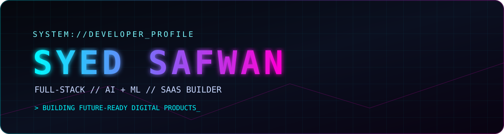

<p align="center">
  
</p>

<p align="center">
  
</p>

<p align="center">
  
</p>

```text
╔══════════════════════════════════════════════════════════════════╗
║ USER   : Syed Safwan                                             ║
║ ROLE   : Full-Stack Developer / AI Engineer / SaaS Builder       ║
║ FOCUS  : Web • Cloud • Data • Automation • Interactive Systems    ║
╚══════════════════════════════════════════════════════════════════╝
```

## `> ABOUT_ME`

I design and build scalable digital products combining modern web engineering, artificial intelligence, data systems, and cloud technologies.

I create production-ready applications, SaaS platforms, automation systems, APIs, and interactive digital experiences.

- Building full-stack applications from idea to deployment
- Developing AI-powered and data-driven solutions
- Creating scalable SaaS products
- Designing modern web experiences
- Connecting frontend, backend, databases, and cloud infrastructure

## `> TECH_STACK`

### 🧠 Languages / Data / AI
<p></p>
<p>Python • Pandas • NumPy • Scikit-Learn • Machine Learning • Data Analysis</p>

### 🌐 Frontend / Creative Development
<p></p>
<p>Next.js • React • Three.js • TypeScript • TailwindCSS • Framer Motion</p>

### ⚙️ Backend / Database / SaaS
<p></p>
<p>Node.js • Express • Flask • PostgreSQL • MongoDB • Redis • Supabase • Firebase</p>

### 🚀 DevOps / Cloud / Workflow
<p></p>
<p>Git • GitHub • Docker • Vercel • AWS • Linux • CI/CD</p>

## `> GITHUB_SIGNAL`

<p align="center">

</p>

<p align="center">


</p>

## `> WHAT_I_BUILD`

<table>
<tr><td><h3>🚀 SaaS Products</h3>Subscription platforms, dashboards, authentication, payments, and scalable cloud applications.</td><td><h3>🧠 AI Applications</h3>Machine learning systems, automation, and intelligent workflows.</td></tr>
<tr><td><h3>🌐 Web Platforms</h3>Modern full-stack products with beautiful interfaces.</td><td><h3>⚡ Digital Systems</h3>APIs, integrations, developer tools, and automation.</td></tr>
</table>

## `> CONTACT_NODE`

<p align="center"></p>
